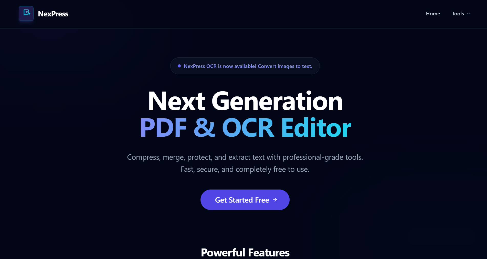
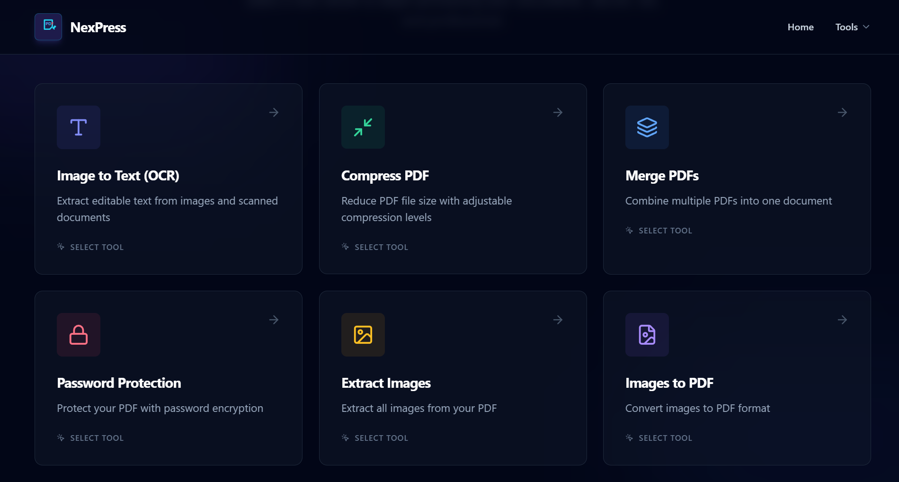
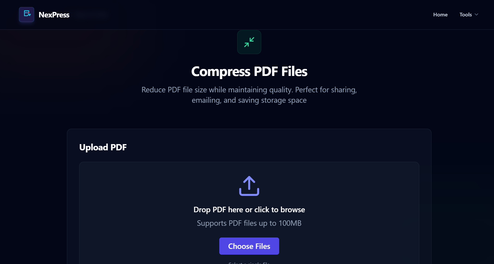
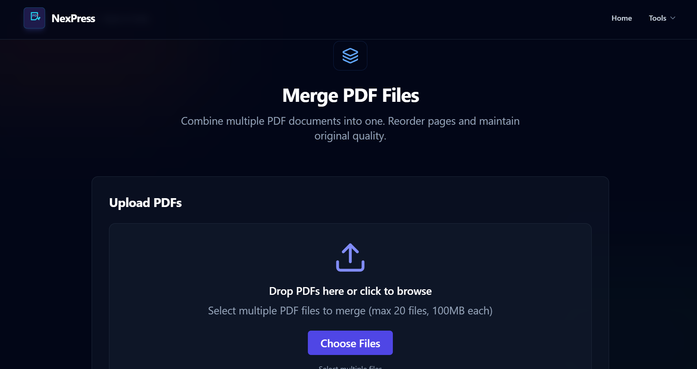
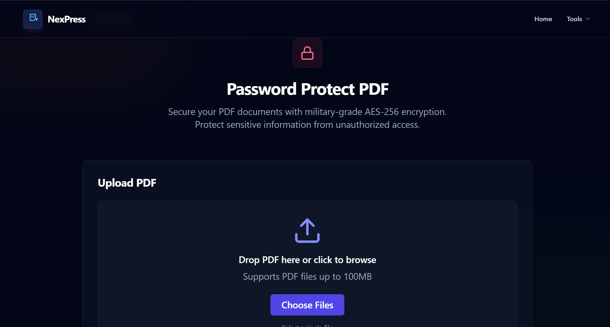
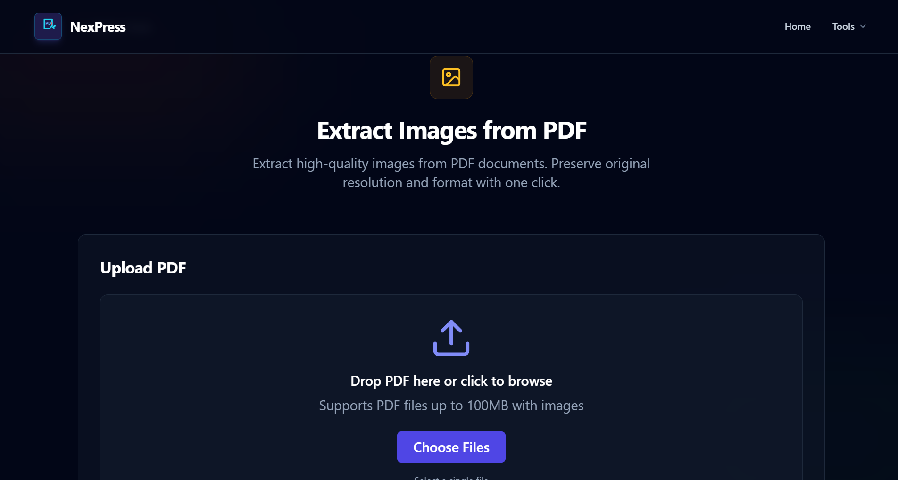
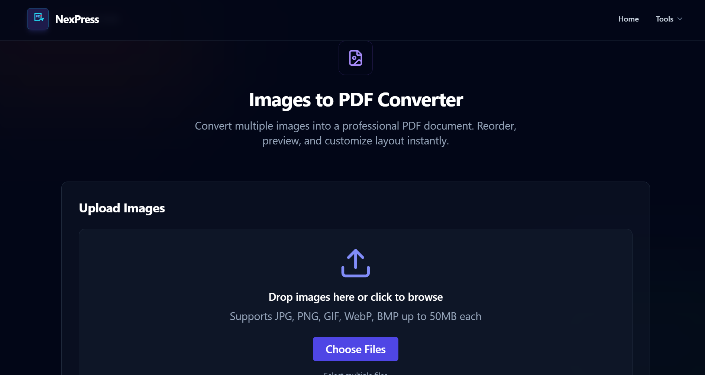
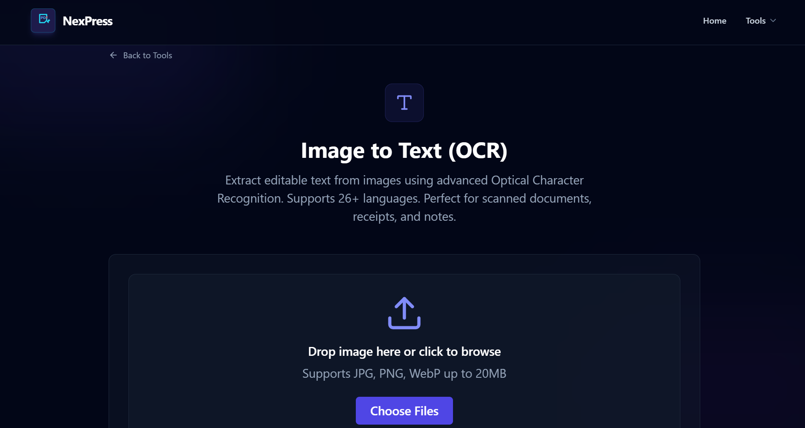

# NexPress — Next Generation PDF & OCR Editor

<p align="center">
  
</p>

<p align="center">
  <strong>A fully client-side PDF utility toolkit and OCR engine built with React.</strong><br />
  All processing happens in your browser — <em>no files ever leave your device.</em>
</p>

<p align="center">
  
  
  
  
  
  
</p>

<p align="center">
  <a href="https://nexpresshrx.netlify.app/" target="_blank" rel="noopener noreferrer">
    
  </a>
</p>

---

## 📖 About

**NexPress** is a browser-based PDF powerhouse that gives you six essential tools — all running locally on your machine. No uploads, no servers, no privacy risks. Whether you need to compress a bulky PDF, merge documents, extract images, run OCR on a scanned file, or protect a document with a password, NexPress handles it instantly and securely.

Built with **React 19**, **Vite 7**, and **Tailwind CSS 3**, NexPress delivers a smooth, modern UI with animated transitions and a fully responsive design.

---

## ✨ Features

| Tool                       | Description                                                                           |
| -------------------------- | ------------------------------------------------------------------------------------- |
| 🔽 **Compress PDF**        | Reduce PDF file size with 4 compression levels (Low / Medium / High / Aggressive)     |
| 🔗 **Merge PDF**           | Combine multiple PDFs into one with drag-and-drop reordering                          |
| 🔒 **Password Protect**    | Encrypt PDFs with AES-256 — user password + auto-generated owner password             |
| 🖼️ **Extract Images**      | Extract all raster images from PDF pages; download individually or as a ZIP           |
| 📄 **Images to PDF**       | Convert JPG, PNG, GIF, WebP, and BMP images into a PDF with portrait/landscape layout |
| 📝 **Image to Text (OCR)** | Extract text from images using Tesseract.js with support for 26+ languages            |

### Additional Highlights

- ⚡ **100% Client-Side** — No backend, no database, no data uploads
- 🎨 **Dark Theme UI** — Built with Tailwind CSS, modern slate/indigo palette
- 🌀 **Animated Transitions** — Powered by Framer Motion
- 📱 **Fully Responsive** — Works on desktop, tablet, and mobile
- 🔒 **Privacy First** — All files stay in your browser; nothing is sent to a server

---

## 🛠️ Tech Stack

| Category             | Technology                                                          |
| -------------------- | ------------------------------------------------------------------- |
| **Framework**        | [React 19](https://react.dev/)                                      |
| **Build Tool**       | [Vite 7](https://vitejs.dev/)                                       |
| **Styling**          | [Tailwind CSS 3](https://tailwindcss.com/) + PostCSS + Autoprefixer |
| **Routing**          | [React Router DOM 7](https://reactrouter.com/)                      |
| **Animations**       | [Framer Motion 12](https://www.framer.com/motion/)                  |
| **Icons**            | [Lucide React](https://lucide.dev/)                                 |
| **PDF Manipulation** | [pdf-lib](https://pdf-lib.js.org/)                                  |
| **PDF Preview**      | [react-pdf](https://projects.wojtekmaj.pl/react-pdf/) / pdfjs-dist  |
| **OCR Engine**       | [Tesseract.js](https://tesseract.projectnaptha.com/)                |
| **ZIP Bundling**     | [JSZip](https://stuk.github.io/jszip/)                              |
| **Linting**          | ESLint 9                                                            |

---

## 🏗️ Architecture Overview

NexPress is a **Single Page Application (SPA)** with no backend. All logic lives in the browser:

```
┌─────────────────────────────────────────────────┐
│                   Browser                         │
│                                                   │
│   ┌──────────────┐   ┌───────────────────────┐   │
│   │   React App   │──▶│   React Router (7     │   │
│   │   (Vite SPA)  │   │   client-side routes) │   │
│   └──────┬───────┘   └───────────────────────┘   │
│          │                                        │
│          ▼                                        │
│   ┌──────────────────────────────────────────┐    │
│   │              PDF Utility Engine            │    │
│   │  ┌─────────┐ ┌────────┐ ┌─────────────┐  │    │
│   │  │ pdf-lib │ │ pdfjs  │ │ Tesseract.js │  │    │
│   │  └─────────┘ └────────┘ └─────────────┘  │    │
│   │  ┌─────────┐ ┌────────┐                  │    │
│   │  │ JSZip   │ │ Browser│                  │    │
│   │  │         │ │  APIs  │                  │    │
│   │  └─────────┘ └────────┘                  │    │
│   └──────────────────────────────────────────┘    │
└─────────────────────────────────────────────────┘
```

**Data flow:** User uploads a file → File is read as `ArrayBuffer` / data URL → Processed by the appropriate library (pdf-lib, Tesseract.js, etc.) → Result is downloaded via browser APIs. No network requests are made.

---

## 📸 Screenshots

### Home Page


### Tools Hub



### Compress PDF



### Merge PDF



### Password Protect



### Extract Images



### Images to PDF



### OCR — Image to Text



---

## 📦 Installation

### Prerequisites

- [Node.js](https://nodejs.org/) v18 or higher
- npm v9 or higher

### Steps

```bash
# Clone the repository
git clone https://github.com/harysri/nexpress.git
cd nexpress

# Navigate to the client directory
cd client

# Install dependencies
npm install
```

---

## 🚀 Running the Project

### Development Server

```bash
npm run dev
```

The app will be served at **http://localhost:5173** with hot module replacement.

### Production Build

```bash
npm run build
```

Build output is written to the `dist/` directory.

### Preview Production Build

```bash
npm run preview
```

### Lint

```bash
npm run lint
```

---

## 🗂️ Folder Structure

```
nexpress/
│
├── client/                        # React application root
│   ├── public/
│   │   └── vite.svg               # Favicon
│   ├── src/
│   │   ├── assets/                # Static assets
│   │   ├── components/            # Reusable UI components
│   │   │   ├── Navbar.jsx         # Top navigation bar
│   │   │   ├── Footer.jsx         # Site footer
│   │   │   ├── FileUpload.jsx     # Drag-and-drop file uploader
│   │   │   ├── PDFPreview.jsx     # PDF preview modal
│   │   │   └── ScrollToTop.jsx    # Route scroll reset
│   │   ├── Pages/                 # Route-level page components
│   │   │   ├── Home.jsx           # Landing page
│   │   │   ├── PdFEdit.jsx        # Tools hub / grid
│   │   │   ├── CompressPDF.jsx    # PDF compression tool
│   │   │   ├── MergePDF.jsx       # PDF merging tool
│   │   │   ├── ProtectPDF.jsx     # PDF password tool
│   │   │   ├── ExtractImages.jsx  # Image extraction tool
│   │   │   ├── ImagesToPDF.jsx    # Image-to-PDF converter
│   │   │   └── ImageToText.jsx    # OCR tool
│   │   ├── utils/
│   │   │   └── pdfUtils.js        # Core PDF/OCR utility functions
│   │   ├── App.jsx                # Root component with routes
│   │   ├── main.jsx               # React entry point
│   │   ├── index.css              # Global styles (Tailwind)
│   │   └── App.css
│   ├── index.html                 # HTML entry point
│   ├── package.json               # Dependencies & scripts
│   ├── vite.config.js             # Vite configuration
│   ├── tailwind.config.js         # Tailwind CSS configuration
│   ├── postcss.config.js          # PostCSS configuration
│   └── eslint.config.js           # ESLint configuration
│
├── screenshots/                   # 📸 Screenshots for README
├── README.md                      # This file
└── LICENSE
```

---

## 🧭 API Reference

NexPress has **no backend API**. All processing is done entirely client-side using the following routes:

| Route             | Page           | Description                               |
| ----------------- | -------------- | ----------------------------------------- |
| `/`               | Home           | Landing page with hero, features, and CTA |
| `/pdf-edit`       | Tools Hub      | Grid of all available PDF tools           |
| `/compress`       | Compress PDF   | Compress uploaded PDF files               |
| `/merge`          | Merge PDF      | Merge multiple PDFs with reordering       |
| `/protect`        | Protect PDF    | Encrypt PDF with password                 |
| `/extract-images` | Extract Images | Extract images from PDF pages             |
| `/images-to-pdf`  | Images to PDF  | Convert images to a PDF document          |
| `/image-to-text`  | Image to Text  | OCR text extraction from images           |

---

## 📖 Usage Guide

### Compress a PDF

1. Navigate to the **Compress PDF** tool.
2. Upload a PDF file via drag-and-drop or file picker.
3. Select a compression level (Low / Medium / High / Aggressive).
4. Click **Compress** — the processed file downloads automatically.

### Merge PDFs

1. Navigate to **Merge PDF**.
2. Upload multiple PDF files.
3. Drag and drop to reorder them as needed.
4. Click **Merge** to download the combined PDF.

### Password Protect

1. Navigate to **Password Protect**.
2. Upload a PDF and enter a strong password.
3. Click **Protect** — the encrypted PDF downloads immediately.

### Extract Images

1. Navigate to **Extract Images**.
2. Upload a PDF. All embedded raster images are detected.
3. Preview and download images individually or as a ZIP bundle.

### Convert Images to PDF

1. Navigate to **Images to PDF**.
2. Upload one or more images (JPG, PNG, GIF, WebP, BMP).
3. Choose **Portrait** or **Landscape** layout.
4. Click **Convert** to download the resulting PDF.

### OCR — Image to Text

1. Navigate to **Image to Text**.
2. Upload an image containing text.
3. Select the language (auto-detected from 26+ options).
4. Click **Extract Text** — results appear instantly. Copy to clipboard with one click.

---

## 🌐 Deployment

### Deploy to Vercel

```bash
npm install -g vercel
vercel
```

### Deploy to Netlify

1. Push your repository to GitHub.
2. Connect the repo in Netlify.
3. Set **Build command** to `cd client && npm install && npm run build`.
4. Set **Publish directory** to `client/dist`.
5. Deploy.

### Deploy to GitHub Pages

```bash
npm run build
npx gh-pages -d client/dist
```

> Since there is no backend, deployment is as simple as hosting a static folder.

---

## 🔮 Future Improvements

- [ ] **Cloud Save** — Optional cloud storage for processed files (Drive, Dropbox)
- [ ] **Batch Processing** — Process multiple files in sequence
- [ ] **PDF to Word / Excel** — Conversion to editable formats
- [ ] **Signature Tool** — Add digital signatures to PDFs
- [ ] **AI-Powered OCR Enhancement** — Improved text recognition via WebAssembly AI models
- [ ] **Dark / Light Theme Toggle**
- [ ] **Offline PWA Support** — Install as a progressive web app
- [ ] **Drag & Drop Reordering for All Tools**
- [ ] **History / Recent Files**

---

## 🤝 Contributing

Contributions are welcome and appreciated! Here's how you can help:

1. **Fork** the repository.
2. **Create a feature branch:** `git checkout -b feature/amazing-feature`
3. **Commit your changes:** `git commit -m 'Add amazing feature'`
4. **Push to the branch:** `git push origin feature/amazing-feature`
5. **Open a Pull Request.**

Please make sure your code passes linting (`npm run lint`) and follows the existing code style.

---

## 📄 License

Distributed under the **MIT License**. See [`LICENSE`](./LICENSE) for more information.

---

## 👤 Author

**Your Name**

- GitHub: [@harysri](https://github.com/harysri)
- Email: sriharisatheeshan820@gmail.com

---

## 🙏 Acknowledgements

- [React](https://react.dev/) — UI library
- [Vite](https://vitejs.dev/) — Build tool
- [Tailwind CSS](https://tailwindcss.com/) — Utility-first CSS framework
- [pdf-lib](https://pdf-lib.js.org/) — PDF creation and manipulation
- [Tesseract.js](https://tesseract.projectnaptha.com/) — JavaScript OCR engine
- [JSZip](https://stuk.github.io/jszip/) — ZIP file creation
- [Framer Motion](https://www.framer.com/motion/) — Animation library
- [Lucide](https://lucide.dev/) — Beautiful open-source icons
- [react-pdf](https://projects.wojtekmaj.pl/react-pdf/) — PDF rendering in React
- [react-router](https://reactrouter.com/) — Client-side routing

---

<p align="center">
  Made with ❤️ and ☕
</p>
